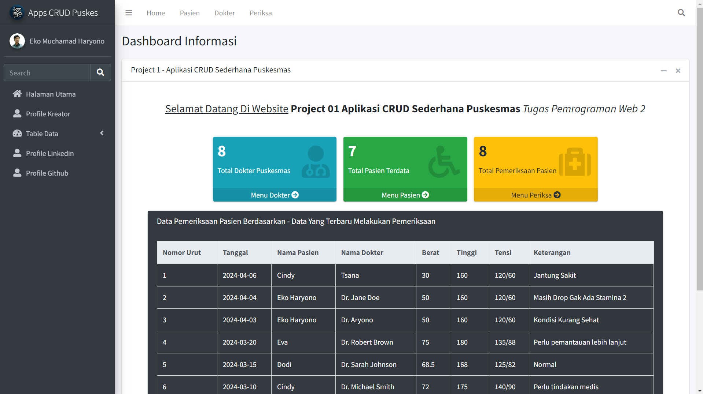

### Identitas Pemilik Tugas:

- **Nama**: Eko Muchamad Haryono
- **NIM**: 0110223079
- **Kelas**: TI-02
- **Semester**: 2
- **Mata kuliah**: Pemrograman Web 2
- **Nama Dosen**: Dr. Sirojul Munir, S.Si., M.Kom

# Aplikasi CRUD Sederhana Puskesmas dengan PHP, MySQL, dan AdminLTE

## Deskripsi

Projek ini bertujuan untuk membuat aplikasi CRUD sederhana. Aplikasi ini menggunakan teknologi PHP, MySQL, dan AdminLTE. Terdapat lima tabel yang akan diolah, yaitu pasien, periksa, dokter,  unit kerja & kelurahan.

### Link Project 01

1. [Project 01 - Aplikasi CRUD Sederhana Puskesmas
](https://github.com/ekomh170/Project-1-PemWeb-2.git)

## Penjelasan Menu Yang Ada Di Aplikasi

1. **Dashboard Informasi**:
Untuk Menampilkan Informasi Penting Seperti Jumlah Data Pada Setiap Menu & Menampilkan Informasi Data Pemeriksaan Pasien Yang Terburu Setiap Di Input.

2. **Profile Kreator**:
Menu Tambahan Identitas Sang Kreator Aplikasi CRUD Sederhana Puskesmas 

3. **Menu Dokter**:
   - Buat tampilan CRUD untuk dokter yang mencakup:
     - Menampilkan daftar dokter.
     - Menambahkan data dokter baru.
     - Mengedit data dokter yang sudah ada.
     - Menghapus data dokter.
    
4. **Menu Periksa**:
   - Buat tampilan CRUD untuk periksa yang mencakup:
     - Menampilkan daftar periksa.
     - Menambahkan data periksa baru.
     - Mengedit data periksa yang sudah ada.
     - Menghapus data periksa.

5. **Menu Pasien**:
   - Buat tampilan CRUD untuk pasien yang sudah disediakan dalam template project, yang mencakup:
     - Menampilkan daftar pasien.
     - Menambahkan data pasien baru.
     - Mengedit data pasien yang sudah ada.
     - Menghapus data pasien.

6. **Profile Linkedin**:
Untuk Menampilkan Tautan Linkedin Sang Pembuat

7. **Profile Github**:
Untuk Menampilkan Tautan Github Sang Pembuat

## Tech Stack Yang Di Gunakan
   - PHP
   - MySQL
   - AdminLTE
   - Bootstrap

## Informasi Tambahan Project 01
1. **Deadline**: 1 minggu setelah UTS Semester 2.
2. **Pengerjaan Individu**: Proyek ini akan dikerjakan secara individu.
